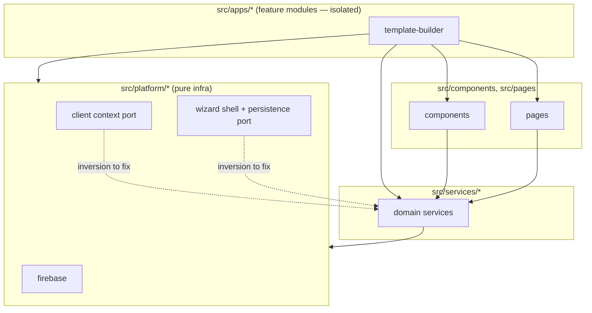

# 04 — Layering & Architecture

## Layer Model (intended)

| Layer | Path | Role |
|---|---|---|
| Base / Platform | `src/platform/*` | Firebase, client context, wizard shell — pure infrastructure |
| Domain / Services | `src/services/*` | Business logic, API clients (Alli, templates, creative, batches, auth) |
| UI | `src/components/*`, `src/pages/*` | Shared UI primitives + route-level pages |
| Feature Modules | `src/apps/*` | Self-contained vertical features (today: `template-builder`) |

Intended dependency direction: **apps → ui → services → platform** (and never the reverse).

---

## Findings

### ✅ Correct flows

- **UI → services**: `src/components/AppLayout.tsx` (lines 4, 16, 19) imports `authService`, `alliService`, `clientAssetHouseService`. `src/pages/CreatePage.tsx` (lines 19, 21) imports `clientAssetHouseService`, `alliService`. Clean downward dependencies.
- **Services**: services do not import from components, pages, or apps. The domain layer is clean.
- **`apps/template-builder` containment**: only one inbound edge from outside the feature — `src/App.tsx:13` imports `AppRoot`. No `src/components/*`, `src/pages/*`, or `src/services/*` file imports anything under `apps/template-builder/`. Outbound dependencies (feature → services, feature → platform `WizardShell`) are expected and correct.
- **No cycles** detected.

### ❌ Layering inversions (platform → domain)

The platform layer reaches up into `services/`, which inverts the dependency direction:

1. `src/platform/client/ClientProvider.tsx:3` — imports `alliService`. The client-context provider (infra) depends on a domain service.
2. `src/platform/wizard/usePersistedStepData.ts:2` — imports `creativeService`. The wizard persistence hook (infra) depends on a domain service.
3. `src/platform/wizard/usePersistedStepData.ts:3` — imports types from `src/apps/*`, blurring the platform↔feature boundary.

These are the only structural violations, but they are load-bearing: every consumer of `ClientProvider` or `WizardShell` transitively imports domain services through the "base" layer, which defeats the purpose of having a base layer.

### Template-builder assessment

`src/apps/template-builder` **is a self-contained feature module today**. It owns its `AppRoot`, `steps/`, `_internal/`, `manifest`, and `types`. Outside code only references it through `App.tsx` and the `_registry`. Outbound dependencies (~10 imports from `services/*`, one from `platform/wizard`) all point downward. The feature-module pattern is working — the discipline now is to keep new apps from leaking the same way as `platform/`.

---

## Target Architecture (recommended)

Keep the four-layer model and enforce **strict downward-only** dependencies. Promote `ClientProvider` and `usePersistedStepData` out of `src/platform/` — either (a) move them into `src/services/` (they are domain-aware) or (b) split them: keep a thin platform-level context/hook that exposes a pluggable port, and put the Alli/creative-aware adapter in `src/services/`. Treat each `src/apps/*` directory as an isolated bounded context: it may import downward (ui/services/platform) but must export only through a manifest entry consumed by `_registry.ts` and `App.tsx`. Add an ESLint `no-restricted-imports` rule (or `eslint-plugin-boundaries`) so platform cannot import from services/components/pages/apps, services cannot import from components/pages/apps, and components/pages cannot import from apps. This freezes the architecture intent in CI rather than in convention.

---

## Top violations to address (in order)

1. `src/platform/client/ClientProvider.tsx:3` — extract Alli-aware client resolution into `services/` and inject it into the platform-level provider via props/context.
2. `src/platform/wizard/usePersistedStepData.ts:2` — same treatment: keep a platform-level persistence primitive, move the `creativeService`-specific hook into `services/` or into the consuming feature module.
3. `src/platform/wizard/usePersistedStepData.ts:3` — drop the import from `src/apps/*`; define the type in `platform/wizard` or `services/` so platform never references a feature module.
4. (Preventative) Add lint boundary rules so the next feature module does not re-introduce these inversions.
